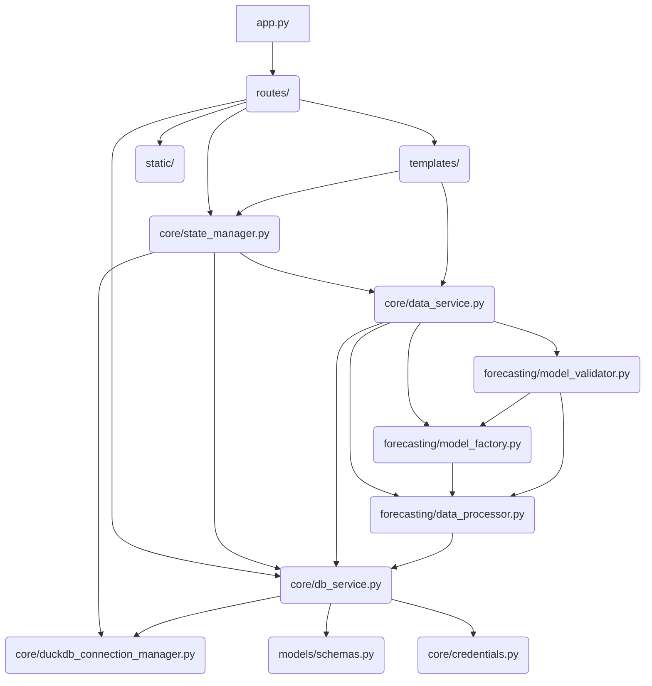

# FastAPI Forecasting Application Architecture Diagrams

This document contains Mermaid diagrams illustrating the high-level and module-level architecture of the application.

## 1. High-Level System Architecture

This diagram shows the main components and their interactions, highlighting the flow from the user interface to the data and modeling layers.

```mermaid
graph TD
    subgraph Frontend (HTMX JS)
        A[User Interface] -- Filter/Action --> B(FastAPI Routes)
        B -- HTML/Data --> A
    end

    subgraph Backend (FastAPI)
        B -- State/DB Access --> C(Core Services)
        B -- Forecasting Logic --> D(Forecasting Module)
        B -- AI Agent --> E(External LLM/Search)
    end

    subgraph Core Services
        C -- Connection Mgmt --> F(DuckDB Connection Manager)
        C -- Data Access --> G(Database Service)
        C -- State Mgmt --> H(DataState)
    end

    subgraph Data Layer
        G -- SQL Query --> I[DuckDB Database]
        J[External ODBC Source] -- Fetch Data --> I
    end

    subgraph Forecasting Module
        D -- Data Prep --> K(Data Processor)
        D -- Model Creation --> L(Model Factory)
        D -- Validation --> M(Model Validator)
    end

    D -- Read/Write --> I

    style Frontend fill:#f9f,stroke:#333,stroke-width:2px
    style Backend fill:#ccf,stroke:#333,stroke-width:2px
    style Core Services fill:#ddf,stroke:#333,stroke-width:2px
    style Forecasting Module fill:#cfc,stroke:#333,stroke-width:2px
    style Data Layer fill:#ffc,stroke:#333,stroke-width:2px
```

## 2. Module Dependency Diagram

This diagram illustrates the dependencies between the main Python modules.



## 3. Forecasting Pipeline Flow

This sequence diagram details the steps involved when a user triggers a forecasting action from the UI.

```mermaid
sequenceDiagram
    participant UI as HTMX Dashboard
    participant API as FastAPI /api/actions
    participant State as DataState
    participant DB as DatabaseService
    participant DS as DataService
    participant FM as ModelFactory
    participant MV as ModelValidator

    UI->>API: POST /api/actions (ActionRequest: 'Create Models')
    API->>State: set_loading_state('charts', True)
    API->>DS: run_mlforecast_pipeline(filtered_df)
    DS->>DS: prepare_data_for_mlforecast()
    DS->>DS: create_mlforecast_models()
    DS->>FM: EnsembleForecaster.generate_forecasts()
    FM-->>DS: Forecasts (pl.DataFrame)
    DS->>DB: insert_forecasts(forecast_df)
    DB-->>DS: Success
    DS-->>API: Forecasts/Metadata
    API->>State: update_filtered_data(forecast_df)
    API->>State: set_loading_state('charts', False)
    API->>UI: UpdateResponse (HTML for charts/table)

    alt Validation Action
        UI->>API: POST /api/actions (ActionRequest: 'Validation')
        API->>MV: validate_last_3_months()
        MV->>DB: get_sales_actuals()
        MV-->>API: ValidationMetrics
        API->>UI: UpdateResponse (HTML for Validation Dialog)
    end