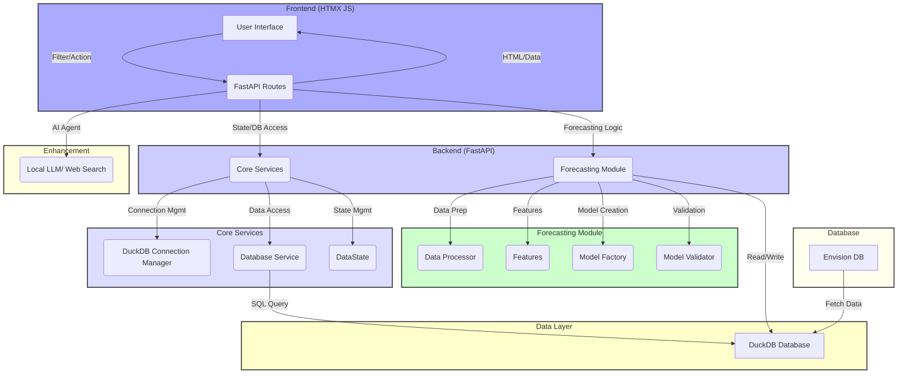
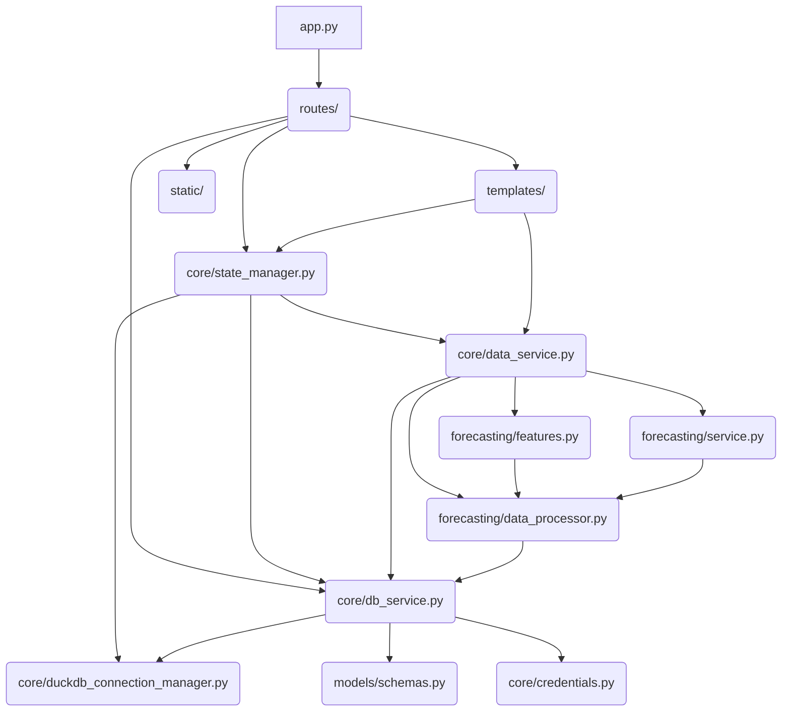
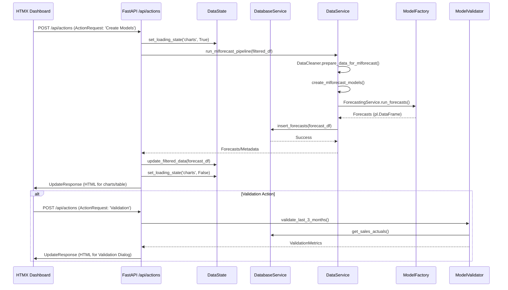

# FastAPI Forecasting Application Architecture Diagrams

This document contains Mermaid diagrams illustrating the high-level and module-level architecture of the application.

## 1. High-Level System Architecture

This diagram shows the main components and their interactions, highlighting the flow from the user interface to the data and modeling layers.

## 2. Module Dependency Diagram

This diagram illustrates the dependencies between the main Python modules.

## 3. Forecasting Pipeline Flow

This sequence diagram details the steps involved when a user triggers a forecasting action from the UI.

